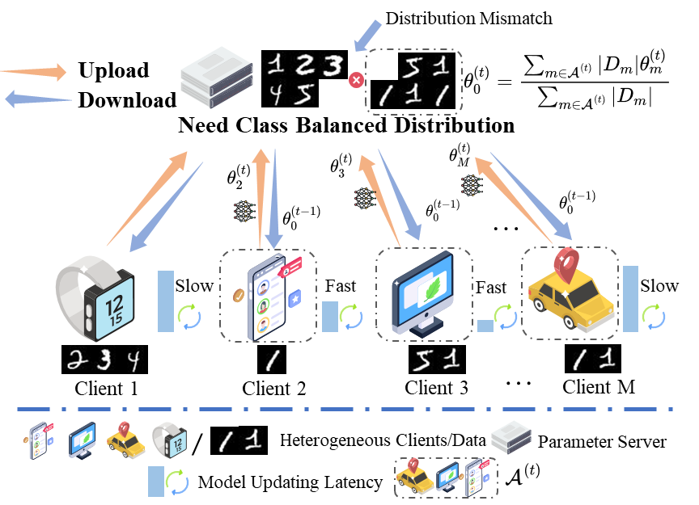
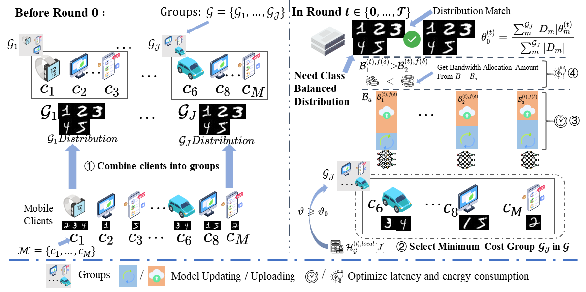

## Joint Class-Balanced Client Selection and Bandwidth Allocation for Cost-Efficient Federated Learning in Mobile Edge Computing Networks

---

The paper has been accepted by IEEE Trans. Mobile Comput. 

**Title:** Joint Class-Balanced Client Selection and Bandwidth Allocation for Cost-Efficient Federated Learning in Mobile Edge Computing Networks

**Author:**  Jian Tang, Xiuhua Li, Hui Li, Penghua Li, Xiaofei Wang, Victor C. M. Leung


### 1. Background and problem

Given the system and data heterogeneity of MCs, client selection and bandwidth allocation are critical to achieving cost-effective FL in bandwidth-constrained MEC networks. Therefore, we investigate the joint client selection and bandwidth allocation problem to reduce the costs (i.e., latency and energy consumption).

We have formulated the problem and decomposed it into two subproblems. (The process is in the paper.)



Figure 1. Federated Learning Model in a MEC Network. 


### 2. Proposed CBCSBA Framework

The CBCSBA framework consists of solving the holistic subproblem and partial subproblem.
To solve the holistic subproblem, we aim to minimize the number of rounds required for the global model to converge. To solve the partial subproblem, we strive to reduce the costs of each round.



Figure 2. Framework for joint class-balanced client selection and bandwidth allocation.

### 3. Experiments

#### 3.1  Architecture

```
- src
  - allocation_alo # Bandwidth Allocation Algorithm
  - fed_client # client in FL
  - fed_client # server in FL
  - group_module 
  - models
  - optimizers
  - utils
  - cost.py
- getdata.py # data processing
- main.py # main function
```

#### 3.2 Run

You can run through the experiment with the following code

```
python main.py --server proposed 

# --parameters options (Note:see main.py)
```


### 4. Rectification

Here are some written errors in the paper of correction, feel free to point them out. Your correction's are the greatest source of progress for all of us together.

20250207: $\kappa$ should be removed from (5)--(by kt4ngw)


### 5. Citation

Finally, I would like to say this.

If this code was helpful for you, could you please cite this paper and give a star to this project? I really appreciate that !!!

```
J. Tang, X. Li, H. Li, P. Li, X. Wang and V. C. M. Leung, "Joint Class-Balanced Client Selection and Bandwidth Allocation for Cost-Efficient Federated Learning in Mobile Edge Computing Networks," in IEEE Transactions on Mobile Computing, doi: 10.1109/TMC.2025.3539284.
```

or (BibTeX)

```
@ARTICLE{10876775,
  author={Tang, Jian and Li, Xiuhua and Li, Hui and Li, Penghua and Wang, Xiaofei and Leung, Victor C. M.},
  journal={{IEEE} Trans. Mobile Comput.}, 
  title={Joint Class-Balanced Client Selection and Bandwidth Allocation for Cost-Efficient Federated Learning in Mobile Edge Computing Networks}, 
  year={2025},
  volume={},
  number={},
  pages={1-17},
  doi={10.1109/TMC.2025.3539284}}

```
